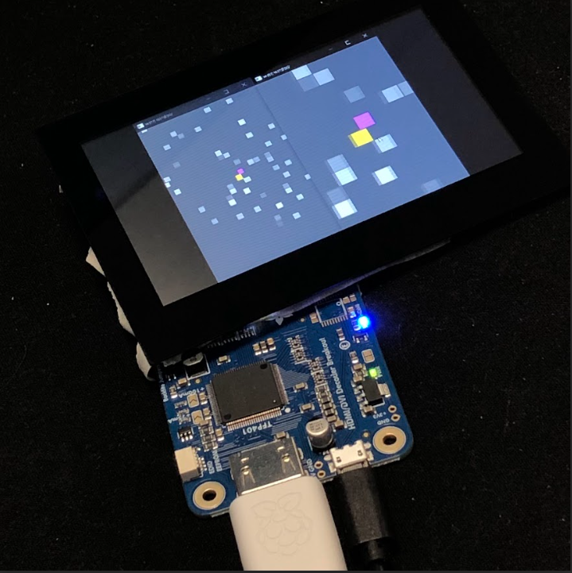

# HeadlessPiPlayer

Headless video player for Raspberry Pi. Primary goal: video player for cosplay contraption.

<p align="center">  </p>

**Features**:
- Loop playback video files
- Upload via: USB FLASH drive & web server
- WIFi credentials set via USB FLASH drive config file
- Logging to internal memory and USB FLASH drive file
- autostart headless mode

## Setup

**Required dependencies**:
- VLC: sudo apt install libvlc-dev

**Dev dependencies**:
- Rust
  - sudo apt install -y curl build-essential
  - curl https://sh.rustup.rs -sSf | sh
  - . "$HOME/.cargo/env"
  - rustc --version

**Startup**:

Add startup entry, probably `autostart` directory should be created:

``` sh
mkdir ~/.config/autostart/
nano ~/.config/autostart/headlesspiplayer.desktop
```

Add content of `headlesspiplayer.desktop`, replace user, user home dir `~` not working here:

```text                                                                                                         
[Desktop Entry]
Type=Application
Exec=/home/<user>/headless_pi_player_entrance.sh
Hidden=false
NoDisplay=false
X-GNOME-Autostart-enabled=true
Name=HeadlessPiPlayerEntrance
Comment=Entrypoint for Headless Pi Player
```

Add startup script:

``` sh
nano ~/headless_pi_player_entrance.sh
```

Add content of`headless_pi_player_entrance.sh` script:

```sh                                                                                                             
#!/bin/bash
sleep 8
whoami > ~/headless_pi_player_started.txt
wlr-randr --output HDMI-A-1 --mode 480x272
sleep 2
Disable screen blanking:
xset s off          # Disable screen saver
xset -dpms          # Disable DPMS (Energy Star) features
xset s noblank      # Don't blank the video device
~/HeadlessPiPlayer/target/release/headless_pi_player >> ~/headless_pi_player.log 2>&1   
```

Some delay is required, file is touched for debug purpose. You can download released version and pass custom path to executive.
   
Make script executable:

``` sh
chmod +x ~/headless_pi_player_entrance.sh
```

## Other

WiFi set via CLI:

```sh
nmcli dev wifi connect "<ssid>" password "<psswd>"
```

Check if Headless Pi player is running:

```sh
ps aux | grep headless_pi_player | grep -v grep
```

Kill process, best kill `.sh` script to kill both in one go:

```sh
kill <pid>
```

## Update WiFi credentials

Create file `wifi_config.json` on USB FLASH drive with content:
```json
{
	"ssid": "your_ssid",
	"psswd": "your_psswd"
}
```

Insert USB FLASH drive into Raspberry Pi USB port.

## Development

To temporary stop running process kill it and then try `cargo run`. It can be good idea to have some release attached and startup script ready to be able to update WiFi credentials.

## Testing

Upload file cmd/curl:

```cmd
curl -F "file=@<path_to_file>"  http://<pi_address>:8080/upload
```

After uploading re-enter page to trigger `GET` methode.
